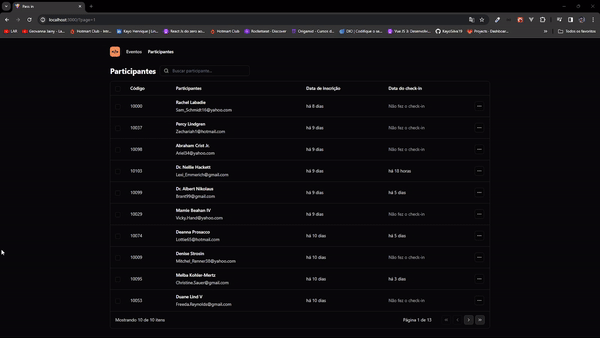

Status: Completo 🚀

## Pass In
O NLW Unite React é um dashboard que visa controlar a data de inscrição e o check-in dos usuários da plataforma, buscando essas informações em uma API em Node.

## Funcionalidades:
 * Home com uma tabela listando os usuários
 * Paginação de usuários
 * Busca de usuários

<hr/>

## Tecnologias Utilizadas:

 * Next
 * TailwindCSS
 * Lucide React
 * prettier plugin tailwindcss
 * typescript
 * tailwind variants

<hr/>

 ## Demonstração:
 
<div>
    
</div>

## Instalação
  * Faça um clone do repositório do projeto no GitHub.
  * Navegue até o diretório do projeto.
  * Execute o seguinte comando para instalar as dependências:

```
$ pnpm install
```

## Running the project
```
$ pnpm run dev
```
